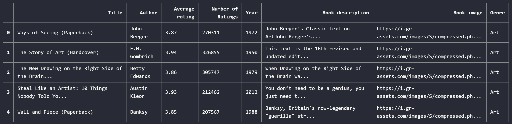
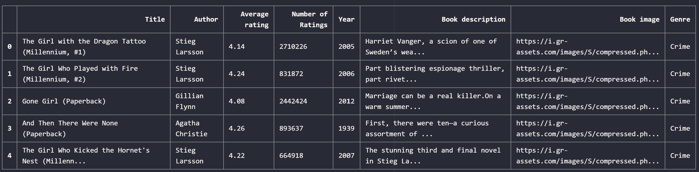
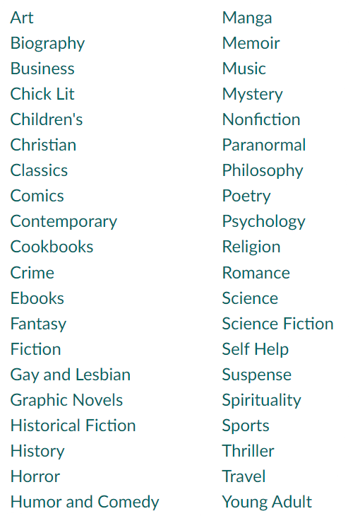

# Goodreads webscraper 

A Goodread.com python script to collect book data from Goodreads.


### Packages needed

- [pandas](https://pypi.org/project/pandas/)
- [time](https://pypi.org/project/python-time/)
- [regex](https://pypi.org/project/regex/)
- [selenium](https://pypi.org/project/selenium/)
- [BeautifulSoup](https://pypi.org/project/beautifulsoup4/)


### Inputs and outputs

The **inputs** of the *goodread_scraper()* function are:

- *sections*: the section or sections to be scrapped. You can use [any shelve of Goodreads](https://www.goodreads.com/genres/list).
- *user_email*: an email registered at Goodreads.com.
- *password*: the password of the email.

*Note: the web-scraper do not store information of any kind besides the books.*

To the scraper to work, it is necessary to use a Goodreads registered user. I have created the a fake user with a fake email that is used as default (see minimal examples section).

The **outputs** are a Dataframe and a csv file with the data structured.

### 3 Minimal examples

1. Webscraping the 'Art' shelve using my default Goodreads user:

```console
terminal@pipe:~$ python -c "from goodreads_scraper.py import *;
                 scrappe_section(['Art'])"
```
Result:



&nbsp;


2. Webscraping the 'Crime' shelve using your own Goodreads account:

```console
terminal@pipe:~$ python -c "from goodreads_scraper.py import *;
                 scrappe_section(['Crime'],
                 user_email = 'an_alternative_mail@gmail.com',
                 password = 'PasswordOfThisGoodReadsMail')"
```

Result:



&nbsp;

3. Webscraping multiple shelves:

```console
terminal@pipe:~$ python -c "from goodreads_scraper.py import *;
                 scrappe_section(['Art', 'Crime', 'Travel'])"
```

Result:


&nbsp;


### Other genres/shelves to webscrape:



[Complete list here](https://www.goodreads.com/genres/list)


### Usage tips

- Take into account that **each shelve/section/genre takes 30-45 minutes to be scrapped**.
- Each section has roughly 1250 books.
- One the scraper starts, you can minimize the chrome driver. Don't click around or scroll the driver page.
